# gyf: A secure file transfer system

## Index 📑

* [Project Overview](https://github.com/JameelGharra/gyf#project-overview)
* [Demo Video](https://github.com/JameelGharra/gyf#demo-video)
* [Features](https://github.com/JameelGharra/gyf#features)
* [Technologies Used](https://github.com/JameelGharra/gyf#technologies-used)
* [Encryption Process](https://github.com/JameelGharra/gyf#encryption-process-asymmetric-and-symmetric-keys) 🔐
* [File Chunking](https://github.com/JameelGharra/gyf#file-chunking-in-network-file-transfer) 📦
  - [Why We Use File Chunking](https://github.com/JameelGharra/gyf#why-we-use-file-chunking)
  - [Chunk Size Considerations](https://github.com/JameelGharra/gyf#chunk-size-considerations)
* [Project Structure](https://github.com/JameelGharra/gyf#project-structure) 📁
* [Codebase](https://github.com/JameelGharra/gyf#codebase) 💻
  - [Class Diagram](https://github.com/JameelGharra/gyf#class-diagram)
  - [Class Descriptions](https://github.com/JameelGharra/gyf#class-descriptions)
* [Setup and Running](https://github.com/JameelGharra/gyf#setup-and-running) 🚀
  - [Server](https://github.com/JameelGharra/gyf#server)
  - [Client](https://github.com/JameelGharra/gyf#client)
* [Security Analysis](https://github.com/JameelGharra/gyf#security-analysis) 🛡️
* [Acknowledgments](https://github.com/JameelGharra/gyf#acknowledgments) 🙏
  
## Project Overview
This project is a client-server file transfer system designed with strong security principles. It demonstrates end-to-end encryption to safeguard files during transmission and ensures data integrity. The aim of the project to simulate real-world secure communication protocols.

## Demo Video (Click to watch)
[](https://www.youtube.com/watch?v=MKZlhTS0B80)

## Features
- Client-Server Architecture: Supports multiple clients interacting with the server.
- Secure Registration and Authentication: Ensures only valid users can access services.
Encryption:
- RSA for secure key exchange.
- AES for encrypting files during transfer.
- Checksum Verification: Confirms the integrity of transmitted files.
- Multi-threaded Server: Concurrently handles multiple clients.
- Persistent Storage: SQLite database to store user information and transferred files.

## Technologies Used
The server-side was implemented in Python, and used selectors to handle clients concurrently as well as cryptodome for cryptographic operations.
The client-side was implemented in C++, used boost for networking and CryptoPP for cryptography.

## Encryption Process: Asymmetric and Symmetric Keys
This project utilizes a **hybrid encryption model**, combining the strengths of **asymmetric (RSA)** and **symmetric (AES)** encryption. RSA is used during the **initial handshake** to exchange a secure session key, ensuring that sensitive data, such as the AES key, is transmitted safely.

Once the **AES key** is exchanged, all subsequent file transmissions are encrypted with AES, which offers high-speed encryption ideal for large files. This approach ensures both **security and efficiency**: RSA protects the key exchange from interception, while AES handles the actual file encryption to ensure fast, reliable data transfer.

Keys are generated dynamically during client-server communication. The client stores the private RSA key securely in the `priv.key` file, and the server uses the client’s public key to encrypt the AES session key. This **hybrid model** guarantees that even if the file transmission is intercepted, the attacker cannot decrypt it without the AES key, which is protected by RSA.

## File Chunking in Network File Transfer

### Why We Use File Chunking

File chunking is a crucial technique in network file transfer for several reasons:

1. **Memory Efficiency**: By breaking large files into smaller chunks, we can process and transfer data without loading the entire file into memory at once. This is particularly important for systems with limited RAM or when dealing with very large files.

2. **Network Reliability**: Smaller chunks are less likely to fail during transmission compared to sending an entire large file at once. If a chunk fails to send, only that chunk needs to be resent, not the entire file.

3. **Improved Performance**: Chunking allows for parallel processing and transfer of data. Multiple chunks can be sent simultaneously, potentially increasing overall transfer speed.

4. **Resume Capability**: If a transfer is interrupted, it can be resumed from the last successfully transferred chunk rather than starting over from the beginning.

5. **Progress Tracking**: Chunking makes it easier to track and display the progress of file transfers, as each chunk represents a measurable unit of progress.

### Chunk Size Considerations

In our implementation, we use a chunk size of 4096 bytes (4 KB). This choice is based on several factors:

```cpp
static constexpr size_t CHUNK_SIZE = 4096; // 4 KB for memory management efficiency
```

1. **Memory Page Size**: 4 KB aligns with the typical memory page size in many systems, which can lead to more efficient memory allocation and management.

2. **Network Packet Size**: While not exactly matching typical network MTU (Maximum Transmission Unit) sizes, 4 KB chunks are small enough to fit within most network packets without fragmentation.

3. **Balance of Efficiency and Overhead**: 4 KB provides a good balance between reducing overhead (fewer chunks to manage) and maintaining the benefits of chunking (not too large to negate the advantages).

4. **File System Considerations**: Many file systems use block sizes that are multiples of 4 KB, making this chunk size efficient for reading from and writing to disk.

5. **Encryption Efficiency**: For encrypted transfers, 4 KB aligns well with common block sizes used in encryption algorithms, potentially reducing padding requirements.

## Project Structure
- `server/`: Contains all server-side Python scripts
- `client/`: Contains all client-side C++ files
- `docs/`: Project documentation and protocol specifications

## Codebase

```mermaid
classDiagram
    class Client {
        -net_manager : NetworkManager
        -proto_handler : ProtocolHandler
        -crypto_manager : CryptoManager
        +start()
    }
    class NetworkManager {
        -io_context : boost::asio::io_context
        -socket : boost::asio::ip::tcp::socket
        -proto_handler : ProtocolHandler
        +establish(host, port)
        +send_request(request : Request*)
        +receive_response_header() ResponseHeader
    }
    class ProtocolHandler {
        -response_code_map : map
        +create_registration_request(name) Request*
        +create_send_public_key_request(id, name, public_key) Request*
        +unpack_response_header(raw_data) ResponseHeader
    }
    class CryptoManager {
        +encode(str) string
        +decode(str) string
        +aes_encrypt(aes_key, plain) string
    }
    class Request {
        #header : RequestHeader
        +create_packet() vector<uint8_t>
    }
    class ResponseHeader {
        +version : uint8_t
        +code : uint16_t
        +payload_size : uint32_t
    }
    class FileChunker {
        -path : string
        -chunked_file : string
        -aes_key : string
        +get_next() string
        +is_finished() bool
    }
    class RSAPrivateWrapper {
        -_rng : CryptoPP::AutoSeededRandomPool
        -_privateKey : CryptoPP::RSA::PrivateKey
        +getPublicKey() string
        +decrypt(cipher) string
    }
    class AESWrapper {
        -key : unsigned char*
        +encrypt(plain : char*, length : unsigned int) string
    }
    class CRCHandler {
        +calculate(file_path) future
    }

    Client --> NetworkManager
    Client --> ProtocolHandler
    Client --> CryptoManager
    Client --> FileChunker
    NetworkManager --> ProtocolHandler
    Request <|-- RegisterRequest
    Request <|-- SendPublicKeyRequest
    Request <|-- ReconnectRequest
    Request <|-- SendFileRequest
    Request <|-- SendCRCStateRequest
    Client ..> Request
    Client ..> ResponseHeader
    NetworkManager ..> ResponseHeader
    Client --> RSAPrivateWrapper
    Client --> AESWrapper
    Client --> CRCHandler
```


**Client**: The main class that orchestrates the client-side operations. It uses NetworkManager for communication, ProtocolHandler for creating requests and parsing responses, and CryptoManager for encryption operations.

**NetworkManager**: Handles network communications, including establishing connections, sending requests, and receiving responses.

**ProtocolHandler**: A singleton class responsible for creating various types of requests and unpacking responses. It encapsulates the protocol-specific logic.

**CryptoManager**: Another singleton class that provides encoding, decoding, and encryption functions.

**Request (and its subclasses)**: Represent different types of requests that can be sent to the server, such as registration, sending public keys, reconnecting, and sending files.

**ResponseHeader**: Represents the header of a response received from the server.

**FileChunker**: Responsible for reading a file and splitting it into chunks for efficient network transmission.

**RSAPrivateWrapper**: Handles RSA encryption operations, including generating key pairs and decryption.

**AESWrapper**: Provides AES encryption functionality.

**CRCHandler**: Calculates CRC (Cyclic Redundancy Check) for file integrity verification.


## Setup and Running
### Server
1. Ensure Python 3.12.1 is installed
2. Install required packages: `pip install pycryptodome`
3. Run the server: `python server/main.py`

### Client
1. Ensure you have Visual Studio 2022 with C++17 support
2. Open the project in Visual Studio
3. Build and run the client application

## Security Analysis
A detailed security analysis of the communication protocol is available in the `docs/vulnerability analysis.pdf` file. This includes potential vulnerabilities, attack vectors, and proposed improvements.

## Acknowledgments
- Roy Mimran for providing the project requirements and guidance
- The open-source community for the encryption libraries used in this project

